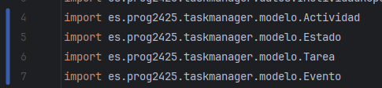
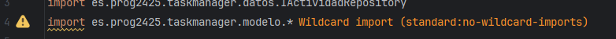
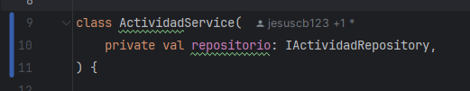
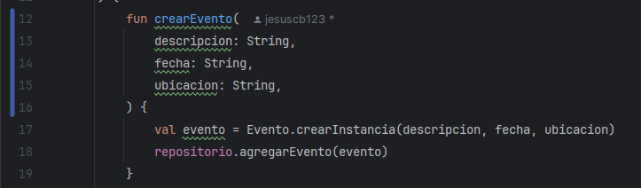
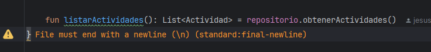
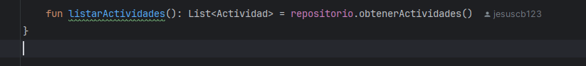
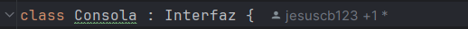

# Analizadores de codigo estatico

## Descripcion de la actividad

La actividad consiste en instalar y usar un analizador de codigo estatico (Detekt o Ktlint) en el proyecto que vienes desarrollando, capturar evidencias graficas, detectar y clasificar errores, aplicar soluciones y explorar las posibilidades de configuracion de la herramienta elegida.

**Pasos:**
1. Instala y usa los analizadores de codigo comentados en clase: Detekt, Ktlint.

## Objetivo

- Conocer que es un analizador de codigo y su proposito.
- Familiarizarse con herramientas como Detekt o Ktlint.
- Usar las herramientas y estudiar y aplicar configuraciones de la herramienta seleccionada.

## Tarea a realizar

1. Instalar la herramienta elegida (Detekt o Ktlint) e incluir capturas de pantalla del proceso.

   

2. Integrar el analizador en el proyecto que se esta desarrollando y ejecutar el analisis.

3. Identificar al menos 5 tipos de errores detectados.

   Para cada tipo de error, documentar:
    - **Descripcion del error.**
    - **Solucion aplicada** (antes y despues, con enlaces a commits especificos).

4. Explorar y modificar al menos una opcion de configuracion del analizador distinta de la predeterminada; describir como afecta al codigo y por tanto al informe de errores.

---

## Preguntas

### [1]
**1.a ¿Que herramienta has usado, y para que sirve?**  
He usado ktlint, un plugin que realiza el formateo y analisis estatico de codigo escrito en Kotlin. Sirve para verificar y aplicar automaticamente convenciones de estilo de codigo.

**1.b ¿Cuáles son sus características principales?**
Una de las principales características de ktlint es la detección automática de errores de estilo, como problemas de espaciado, indentación, uso incorrecto de comas, entre otros. Además, ofrece la opción de formateo automático del código a través del comando ktlintFormat, lo que permite corregir muchas de estas inconsistencias sin intervención manual. Otra ventaja destacada es su integración sencilla con entornos de desarrollo como IntelliJ IDEA y Android Studio, lo cual facilita su adopción en proyectos nuevos o existentes.

**1.c ¿Qué beneficios obtengo al utilizar dicha herramienta?**
El uso de ktlint permite mantener un código limpio y consistente, lo que mejora significativamente su legibilidad y mantenimiento a largo plazo. También contribuye a la detección temprana de problemas menores que, aunque no impidan la ejecución del programa, pueden derivar en errores más complejos o comportamientos inesperados. Además, al seguir una única guía de estilo, se facilita la colaboración entre distintos miembros del equipo, ya que todos trabajan bajo las mismas reglas. Finalmente, al automatizar la revisión de estilo, se logra un ahorro importante de tiempo en los code reviews, permitiendo que los revisores se enfoquen en aspectos funcionales y lógicos del código.

### [2]
**2.a ¿Cual es el error que mas ha mejorado tu codigo?**  
El error relacionado con la falta de comas finales en parametros multilinea: `Missing trailing comma before ")"`.

Este cambio facilita la edicion futura y hace mas limpio el control de versiones (Git), evitando errores comunes al añadir o quitar lineas.

**2.b ¿La solucion te ha parecido correcta y la has entendido?**  
Si, es correcta y comprensible. Añadir una coma final en listas o argumentos multilinea:
- Mejora la legibilidad.
- Reduce los errores al modificar codigo.
- Sigue las buenas practicas modernas de Kotlin.

**2.c ¿Por que se ha producido ese error/problema?**  
Porque la convencion moderna de estilo de Kotlin (cuando habilitas la regla `trailing-comma`) requiere una coma final en listas de parametros o argumentos que se escriben en varias lineas. Esto previene errores y facilita refactors.

### [3]
**3.a ¿Que posibilidades de configuracion tiene la herramienta?**  
Ktlint se puede configurar mediante:
- Un archivo `.editorconfig` donde puedes ajustar cosas como:
    - Indentacion.
    - Comas finales.
    - Longitud maxima de linea.
    - Reglas especificas activadas/desactivadas.

**3.b ¿Cual has configurado para que sea distinta a la que viene por defecto?**  
He dejado la configuracion por defecto que trae el plugin.

**3.c Ejemplo del impacto en el codigo:**  
Puede verse en el apartado de [Errores](#errores).  

Este cambio mejora el mantenimiento y evita errores al agregar nuevos parametros.

### [4]
**¿Que conclusiones sacas despues del uso de estas herramientas?**  
Herramientas como ktlint son muy interesantes para mantener el codigo uniforme, legible y profesional.  
Aunque algunos errores pueden parecer triviales, su correccion mejora la calidad global del codigo.  
Automatizar el formateo y validacion de estilo ahorra mucho tiempo en revisiones manuales.  
Ademas de detectar errores, educa al desarrollador sobre buenas practicas de Kotlin.

---

## Errores

### 1. Importacion con comodin
**Descripcion:** Uso de `import es.prog2425.taskmanager.modelo.*`.  
**Regla:** `no-wildcard-imports`.

**Solucion:**

**Antes:**  

**Despues:**  

**Commit:** [link-al-commit](https://github.com/JoseLuis-S/task_manager_test/commit/c1d9c305328080d52a79f3b06c675851ce35e32a)

---

### 2. Falta de nueva linea tras parentesis de clase
**Descripcion:** No hay salto de linea despues de `ActividadService(...)`.  
**Regla:** `class-signature`.

**Solucion:**

**Antes:**  

**Despues:**  

**Commit:** [link-al-commit](https://github.com/JoseLuis-S/task_manager_test/commit/393c754a7bdc3ed562a98ea77e8565677d0391dd)

---

### 3. Saltos de linea mal ubicados en funciones
**Descripcion:** Falta de salto de linea luego de parentesis de apertura o antes del cierre.  
**Regla:** `function-signature`.

**Solucion:**

**Antes:**  

**Despues:**  

**Commit:** [link-al-commit](https://github.com/JoseLuis-S/task_manager_test/commit/6071094615b1aefa734b1412b523ab8cfa27ba50)

---

### 4. Falta de nueva linea final
**Descripcion:** El archivo no termina con un salto de linea (`\n`).  
**Regla:** `final-newline`.

**Solucion:**

**Antes:**  

**Despues:**  

**Commit:** [link-al-commit](https://github.com/JoseLuis-S/task_manager_test/commit/094353377d5c41fe411a223e19c817b98bfb2396)

---

### 5. Falta espacio antes de los dos puntos
**Descripcion:** Falta espacio antes de los dos puntos.  
**Regla:** `colon-spacing`.

**Solucion:**

**Antes:**  

**Despues:**  

**Commit:** [link-al-commit](https://github.com/JoseLuis-S/task_manager_test/commit/a7e35a46bcaddd7f0de0d4c07073c1a7877d6553)