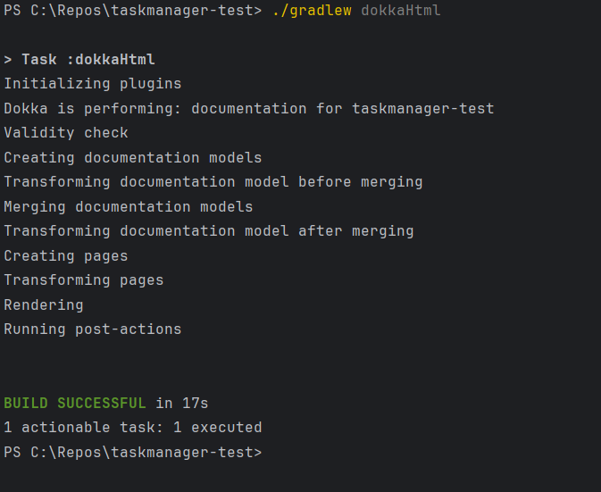

# Actividad: Aplicacion de Code Smells y Patrones de Refactorizacion en el Codigo del Task Manager

## Descripcion

Esta actividad consiste en mejorar el codigo de la aplicacion que estas desarrollando, identificando y corrigiendo los code smells mediante patrones de refactorizacion. Ademas, en al menos una de las refactorizaciones se desarrollaran pruebas unitarias que garanticen que la funcionalidad existente permanece intacta.

---

## Objetivos

- Identificar code smells en el codigo del proyecto que se esta desarrollando y asociarlos a patrones de refactorizacion.
- Aplicar patrones de refactorizacion adecuados usando las herramientas del IDE.
- Desarrollar y ejecutar pruebas unitarias para cada refactorizacion realizada.
- Automatizar y documentar el proceso de refactorizacion y de pruebas.

---

## Preguntas

### [1]
**1.a ¿Que code smell y patrones de refactorizacion has aplicado?**

Mientras analizaba el codigo con el detector que viene integrado en IntelliJ IDEA, me encontre con varios problemas tanto de diseño como de estilo. Para corregirlos, aplique diferentes patrones de refactorizacion segun lo que correspondia en cada caso.

Uno de los problemas mas frecuentes fue el uso de metodos demasiado largos (Long Method), es decir, funciones con muchas lineas de codigo innecesarias o repetidas. Para solucionarlo, fui dividiendo esos bloques en funciones mas pequeñas y reutilizables, extrayendo ademas el codigo duplicado en una funcion comun.

Tambien detecte varios nombres de funciones poco claros o inconsistentes. En esos casos, opte por renombrarlas para que fueran mas descriptivas y reflejaran mejor su proposito.


**1.b Teniendo en cuenta aquella funcionalidad que tiene pruebas unitarias, selecciona un patron de refactorizacion de los que has aplicado y que estan cubiertos por los test unitarios. ¿Por que mejora o no mejora tu codigo? Asegurate de poner enlaces a tu codigo.**

Durante la revision de la clase [GestorActividades.kt](src/main/kotlin/servicios/GestorActividades.kt) detecte distintos code smells como duplicacion de codigo, metodos extremadamente largos o que la misma clase tenia muchas responsabilidades. Para solucionar eso he aplicado algunas tecnicas como extraer clases y metodos.

**Extraer clase:**

He separado la logica del menu para que `GestorActividades` no controlase tantas cosas.

```kotlin
class MenuGestor(
    private val salida: Interfaz,
    private val gestor: GestorActividades
) {
    fun mostrarMenuPrincipal() {
        var salir = false
        do {
            try {
                salida.mostrarMenu()
                when (salida.leerNum()) {
                    -1 -> salida.mostrar("\nOpcion no valida.")
                    1 -> gestor.crearEvento()
                    2 -> gestor.crearTarea()
                    3 -> gestor.listarActividades()
                    4 -> gestor.asociarSubtarea()
                    5 -> gestor.cambiarEstadoTarea()
                    6 -> gestor.cerrarTarea()
                    7 -> gestor.crearUsuario()
                    8 -> gestor.asignarTareaAUsuario()
                    9 -> gestor.consultarTareasUsuario()
                    10 -> gestor.filtrarActividades()
                    11 -> gestor.consultarHistorialTarea()
                    12 -> salir = true
                }
            } catch (e: IllegalStateException) {
                salida.mostrar("$e")
            }
        } while (!salir)
    }
}
```

Con esto consigo que la clase `GestorActividades` no contenga tantas responsabilidades.

**Extraer metodos:**

Se puede observar como la logica de varios de los metodos de la clase esta duplicada (`filtrarPorEtiqueta`, `filtrarPorNombre`...), asi que podemos extraer esta logica a un unico metodo.

```kotlin
private fun cambiarEstadoTarea() {
    val tarea = seleccionarTareaConMensaje("\nSelecciona la tarea cuyo estado deseas cambiar:")
    val nuevoEstado = solicitarEstadoParaTarea() ?: return

    try {
        servicio.cambiarEstadoTarea(tarea, nuevoEstado)
        salida.mostrar("\nEstado de la tarea cambiado exitosamente a ${nuevoEstado.name}.")
    } catch (e: IllegalStateException) {
        salida.mostrar("\nError: ${e.message}")
    }
}

private fun seleccionarTareaConMensaje(mensaje: String): Tarea {
    salida.mostrar(mensaje)
    return obtenerTarea()
}

private fun solicitarEstadoParaTarea(): Estado? {
    salida.mostrar("\nElige el nuevo estado para la tarea:")
    salida.mostrar("1. ABIERTA")
    salida.mostrar("2. EN PROGRESO")
    salida.mostrar("3. FINALIZADA")

    return when (salida.leerNum()) {
        1 -> Estado.ABIERTA
        2 -> Estado.EN_PROGRESO
        3 -> Estado.FINALIZADA
        else -> {
            salida.mostrar("\nOpcion no valida. El estado no ha sido cambiado.")
            null
        }
    }
}
```

Asi queda la clase `GestorActividades` tras la refactorizacion.

---

### [2]
Antes de empezar con cualquier cambio, me aseguro de tener pruebas unitarias que cubran las funcionalidades actuales. Esto me permite validar que el comportamiento de los metodos sigue siendo el esperado despues de refactorizar.

1. Verifico que todos los tests pasan antes de realizar cambios.
2. Realizo la refactorizacion por etapas, ejecutando los tests tras cada cambio.
3. Si algo falla, reviso la funcion afectada y hago rollback si es necesario.
4. Uso control de versiones para mantener un historial claro de los cambios realizados.

---

### [3]
**3.a ¿Que funcionalidad del IDE has usado para aplicar la refactorizacion seleccionada?**

Para aplicar las refactorizaciones, he hecho uso de varias herramientas integradas en el IDE IntelliJ IDEA, que facilitan la identificacion y ejecucion de mejoras en el codigo. Las principales funcionalidades que utilice fueron:

- **Analyze:**  
  Utilice el sistema de inspeccion de codigo que ofrece IntelliJ para detectar automaticamente code smells, advertencias y sugerencias de mejora. Este analisis permite identificar metodos demasiado largos, nombres poco descriptivos y clases con muchas responsabilidades.

  

- **Refactor:**  
  Con Refactor puedo extraer aquellos metodos mas extensos en pequenas funciones.

  

- **Rename:**  
  Me permite renombrar una variable/clase/metodo en todos los sitios en los que esta siendo usado.

  